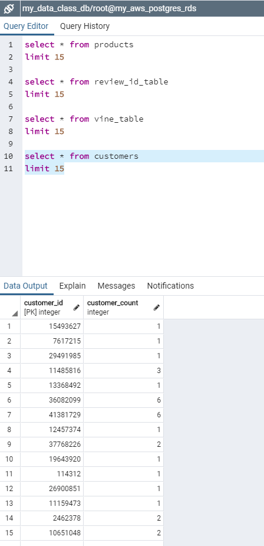
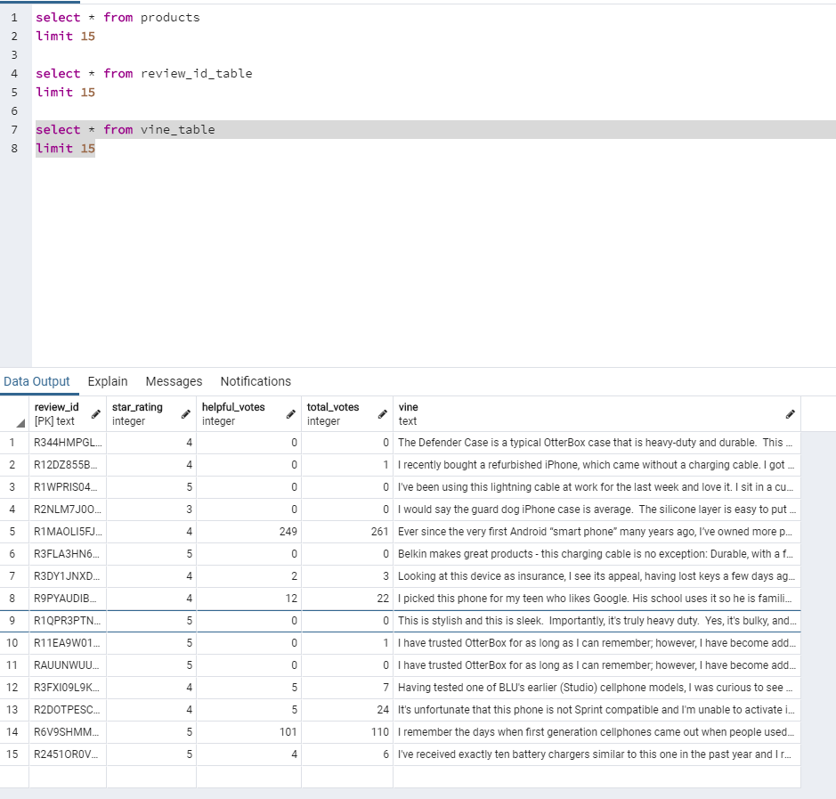
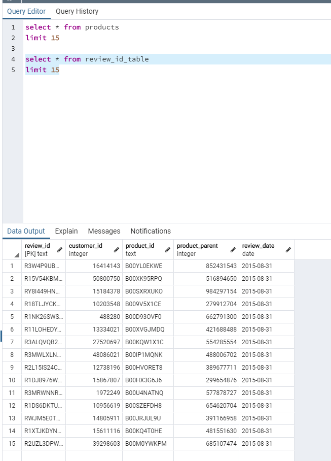
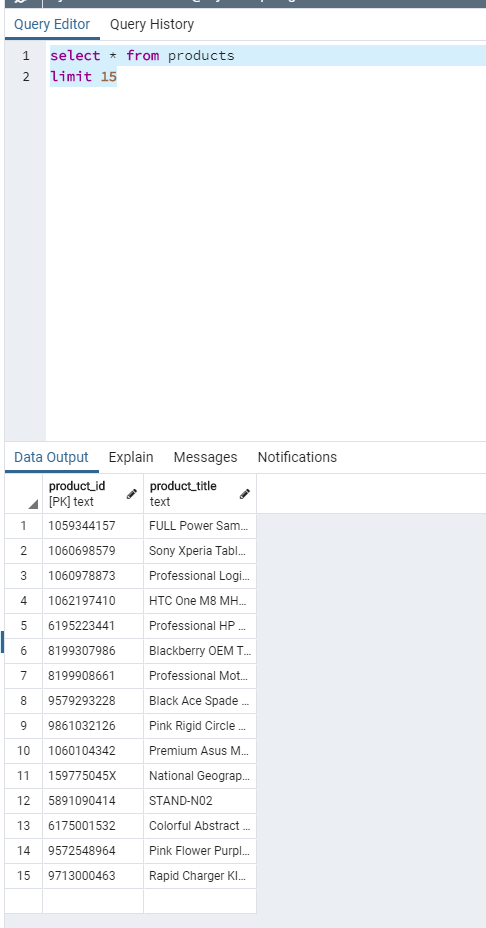

# big-data-challenge
Level 1 - ETL
Level 2 - Analysis
Level 3 - NLP - Baiyes Model

Analysis found on google docs 
https://docs.google.com/document/d/17xDIDUHXRbEKj1ZxmFNnS3tHBbU5palOuBUVHO_Pl14/edit?usp=sharing

Screen capture of database as a result of ETL using pyspark

